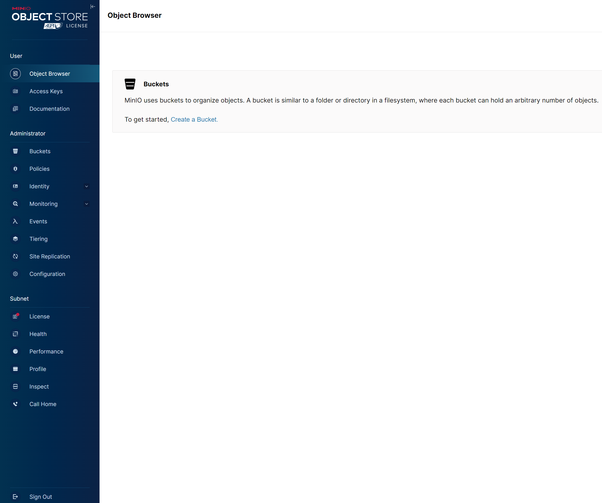

# 实验名称

搭建对象存储

# 实验环境

Windows 11 下 VirtualBox 运行 Ubuntu 22.04 LTS。

Ubuntu 预装 `screen`,`curl`,`docker.io`,`docker` 等软件。

Python 版本默认为 3.10 。

# 实验记录

## 实验1-1: Minio Server

实验环境已经预先搭建好，因此不赘述环境搭建过程。

在[官网](https://min.io/download#/agpl-linux)下载对应的DEB包。

```bash
wget https://dl.min.io/server/minio/release/linux-amd64/minio_20240406052602.0.0_amd64.deb
dpkg -i minio_20240406052602.0.0_amd64.deb
MINIO_ROOT_USER=admin MINIO_ROOT_PASSWORD=password minio server /mnt/data --console-address ":9001"
```

其中`admin`和`password`是默认的根用户名与密码，`/mnt/data`是需要修改的数据目录。

由于是简单的实验环境，数据目录改为~/data，使用screen将minio放在后台直接运行即可。

运行的命令最终如下：

```bash
MINIO_ROOT_USER=admin MINIO_ROOT_PASSWORD=password minio server ~/minio-data --console-address ":9001"
```

运行之后会在本地9001端口开启网页后台。直接访问即可。



## 实验1-2: s3proxy server

但最终还是决定使用 s3proxy 来作为接下来实验使用的对象存储系统服务器。

从 Docker Hub 获取 s3proxy 的 [docker](https://hub.docker.com/r/andrewgaul/s3proxy/)。

跟随当前页面的指引使用如下命令安装 s3proxy 的 docker。
```bash
$ docker pull andrewgaul/s3proxy

$ docker run --publish 80:80 --env S3PROXY_AUTHORIZATION=none andrewgaul/s3proxy

$ curl --request PUT http://127.0.0.1:80/testbucket # 创建bucket

$ curl http://127.0.0.1:80/ # 测试可用性
```
访问本地80端口得到如下结果，说明服务器部署完毕。


s3proxy的docker还可以配置验证方式等。方便起见，这里使用默认的无需验证的设置。

## 实验1-3: boto3

我们使用 [boto3](https://github.com/boto/boto3) 作为访问服务器的客户端。
按照官方库说明，使用如下命令安装boto3。
```bash
$ python -m venv .venv # 设置虚拟环境
$ . .venv/bin/activate # 启用虚拟环境
$ python -m pip install boto3
```

boto3 使用 config 来进行验证配置，但我们对 s3proxy 的设置使我们无需进行任何验证。
我们直接在 python 中硬编码一个随机验证方式即可。

测试 boto3 到服务器连通性的代码如下：
```python
import boto3
import boto3.session

session = boto3.Session(
  aws_access_key_id = 'x', 
  aws_secret_access_key = 'x'
) # Dummy credential

s3 = session.resource('s3', endpoint_url='http://127.0.0.1:80')

for bucket in s3.buckets.all():
    print(bucket.name)
```

结果如图所示，打印所有bucket的结果即为我们在上一节创建的testbucket。


# 实验小结

我们部署了s3proxy与boto3作为对象存储系统服务器的server与client。