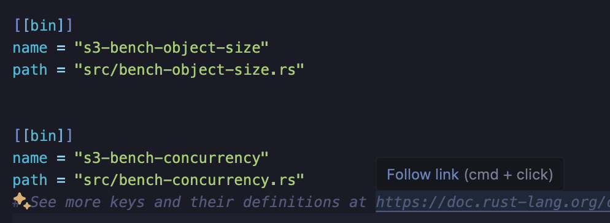
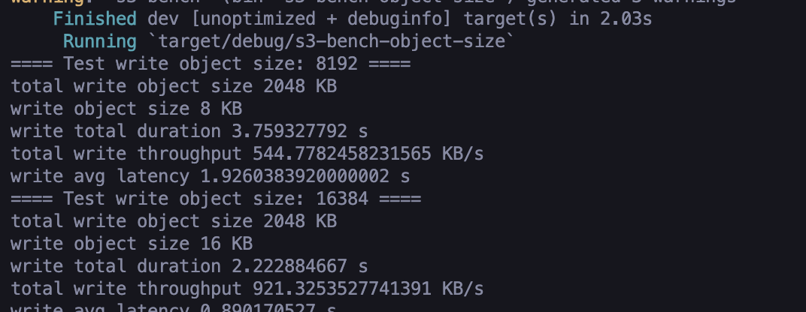
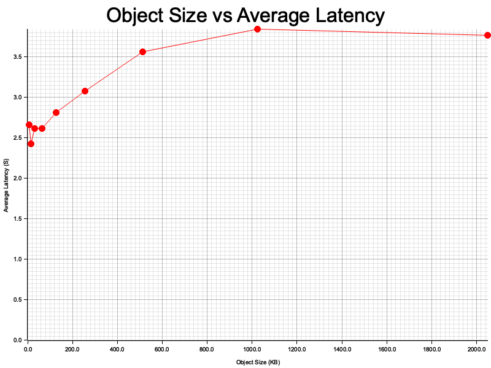
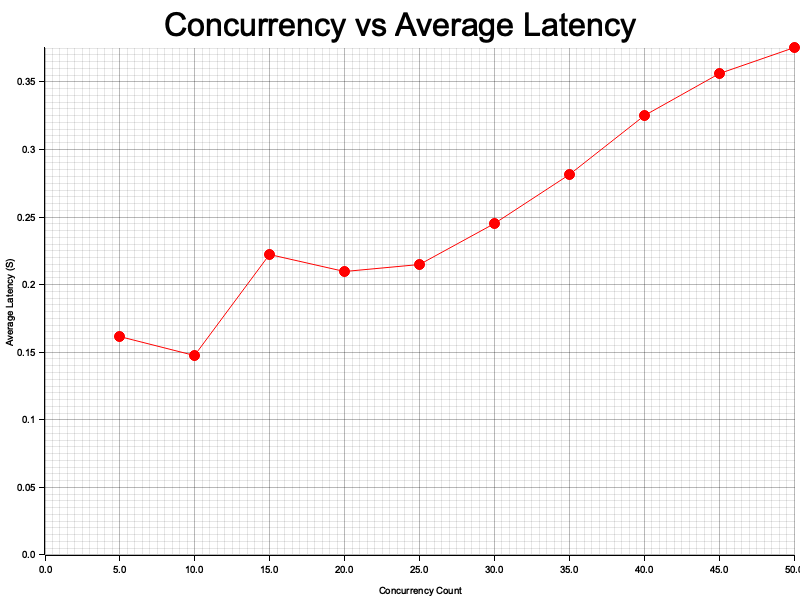
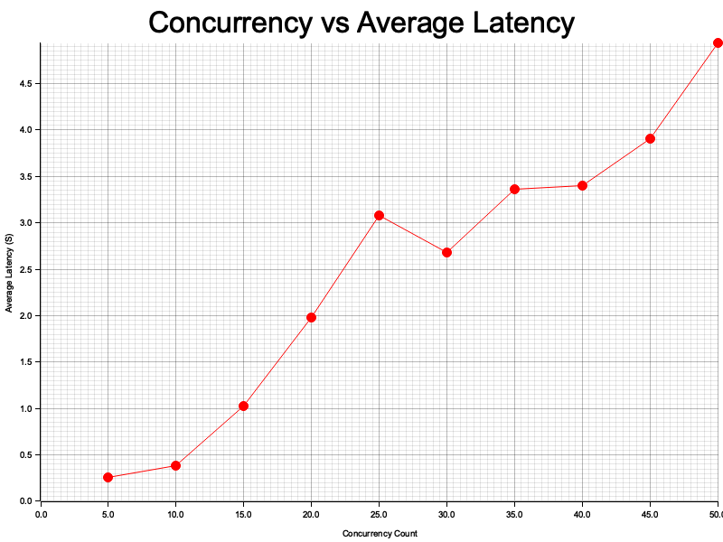
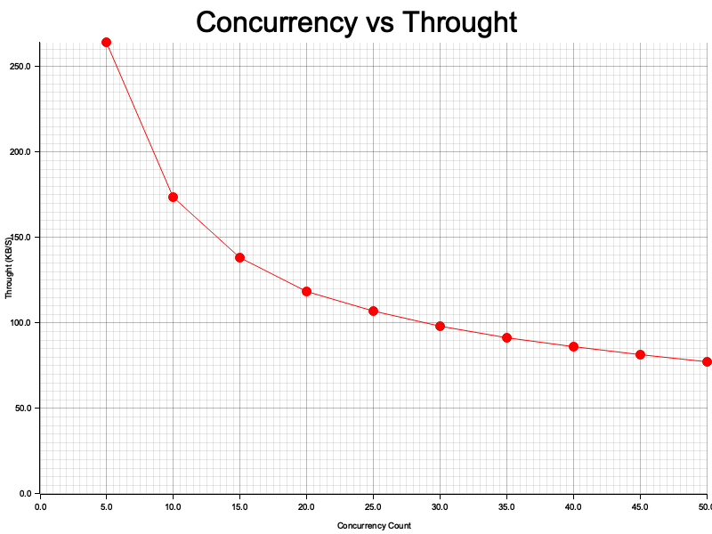
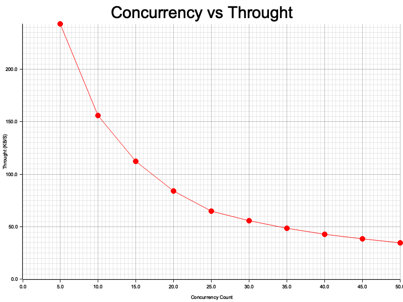

# 实验名称 

编制实验研究分析

# 实验环境

OpenStack-Swift对象存储系统服务端部署在腾讯云服务器上，服务器规格：

| os     | Ubuntu20.04                              |
| ------ | ---------------------------------------- |
| cpu    | Intel Xeon Platinum 8255C (2) @ 2.494GHz |
| memory | 2G                                       |
| server | openstack-swift                          |
| Client | rust-aws-sdk                             |

# 实验记录 

实验采用 rust-aws-sdk 实现对 openstack swift 的读写请求。再利用个人封装的 sdk 通过 get_object，put_object 来对指定容器中的指定对象完成读取、写入操作。

### 1. 观察对象尺寸对性能的影响

实验采用 tokio 作为 rust 异步运行时，在 rust 中 async  和多线程都可以实现并发编程，使用 async 可以有效的降低 cpu 和内存的负担，可以让大量的任务并发的运行，一个任务一旦处于IO或者其他等待(阻塞)状态，就会被立刻切走并执行另一个任务，而这里的任务切换的性能开销要远远低于使用多线程时的线程上下文切换。因此 rust async 适用于高并发的场景（例如 web 服务 等 io密集型任务），在本次实验中我选择使用 rust async 而不是 多线程+线程池 的方式 进行并发编程。rust async 可以参考 https://rust-lang.github.io/async-book/。

在观察对象尺寸对性能影响的实验中，我保持了读写（get/put）的总数据量total_size不变（为4MB），每次只修改对象尺寸 object_size， object_size 分别为 8, 16, 32, 64, 128, 256, 512, 1024, 2048 KB。

PutObject测试流程：

1. 在./file下创建指定大小的测试目标文件（8, 16, 32, 64, 128, 256, 512, 1024, 2048 KB），用于在client和server之间传输。
2. 对不同大小的文件（例如对于512KB的文件，总传输大小是4MB不变，因此需要传输4MB/512KB = 8次）执行并发任务，测量和记录它们的传输总时间，延迟。
3. 分别计算得到传输不同大小文件时的平均延迟，吞吐量。

详情可见 [bench-object-size.rs](./asserts/s3-bench/src/bench-object-size.rs)

在rust项目中可以定义生成多个bin，在本次项目中我定义了可执行文件s3-bench-object-size`和`s3-bench-concurrency，s3-bench-object-size 对应的源代码在src/bench-object-size.rs，而 s3-bench-concurrency 对应的源代码在 src/bench-concurrency.rs。

测试时可以直接运行`cargo run --bin s3-bench-object-size`，观察对象尺寸对性能的影响，如下图所示。

实验观测的结果为：

1. 写操作对象尺寸与平均延迟的关系

​	可以观察到在对象尺寸为8, 16, 32 KB时，平均延迟很高，以8KB文件为例子，传输8KB的文件需要4MB/8KB = 512次，同时需要传输的文件较小，rust 异步为用户屏蔽了底层线程相关的操作，可以知道的是，rust中任务的切换发生在用户态，尽管传输8KB需要512个任务，但是底层实际创建的线程远小于512，任务的切换以及连接的建立耗费大量时间，导致平均延迟上升。当传输256KB时可以观察到，此时需要传输次数为 4MB/256KB = 8次，证明当并发量减少同时传输对象尺寸增大时，可以减少平均延迟时间，当并发量继续减少同时传输对象尺寸继续增大时，例如对象尺寸从256KB到2048KB，传输延迟微量上升基本平稳，证明当对象尺寸较大时，I/O 的带宽基本跑满。

2. 读操作对象尺寸与平均延迟的关系

   

​	可以观察到当对象大小继续从512KB增加到2048KB中，读操作的平均延迟开始明显增长，并且这个增长趋势与对象大小大致呈正比。推测在处理较大的对象时，I/O带宽被充分利用，成为了制约服务器和客户端之间数据传输的主要瓶颈。因此，随着对象大小的增加，完成整个对象传输的延迟也开始按比例增长。

3. 写操作对象尺寸与吞吐量的关系

   

   随着对象大小由8KB增加到256KB，client 向 server 的写操作吞吐量显著提升。推测原因处理较大的单个对象，相比于处理许多小对象，会有更好的性能。主要是因为处理较少的大对象意味着可避免在多余的操作上（如建立连接等）花费过多时间和资源，这些操作与数据传输本身无关。而对象大小由256KB增加到2048KB，client 向 server 的写操作吞吐量趋于稳定。

4. 读操作对象尺寸与吞吐量的关系

​	可以观察到读操作时，吞吐量的变化规律与写操作类似，同时总体吞吐量远小于写操作，使用speedtest测速可以发现，服务端的 upload 带宽小于 download 带宽，因此可以解释这种现象。

### 2. 观察并发度对性能的影响

总体测试方法与观察对象尺寸对性能的影响类似，在本次实验中限制传输的数据总量 total_size 为 4MB，每次传输的对象尺寸object_size 为 64KB，并发度分别为5, 10, 15, 20, 25, 30, 35, 40, 45, 50。由于rust async 无法直接限制并发数量，因此我使用rust中的Semaphore对并发运行的任务数量进行限制。

详情可见 [bench-concurrency.rs](./asserts/s3-bench/src/bench-concurrency.rs)，设置信号量初始值为concurrency_count, 在运行任务前进行P操作，由于rust所有权机制，当离开作用域后会自动进行v操作。

测试时可以直接运行`cargo run --bin s3-bench-concurrency`，观察并发度对性能的影响，如下图所示。

实验观测的结果为：

1. 写操作并发度与平均延迟的关系

​	可以观察到随着并发数量的增加，平均延迟逐渐上升，推测时由于并发任务数量的增加，每个任务的线程可利用的带宽随着并行度的增长而减小。

2. 读操作并发度与平均延迟的关系

​	可以观察到随着并发数量的增加，平均延迟总体呈上升趋势，推测原因与写操作类似，同时由于服务端的 upload 带宽小于 download 带宽，读操作延迟更大。

3. 写操作并发度与吞吐量的关系

​	可以观察到随着并发数量的增加，写吞吐量逐渐下降。

4. 读操作并发度与吞吐量的关系

   

​	可以观察到随着并发数量的增加，读吞吐量逐渐下降。与写操作类似。

# 实验小结

编制实验分析并了解对象尺寸与并发度对性能的影响。
