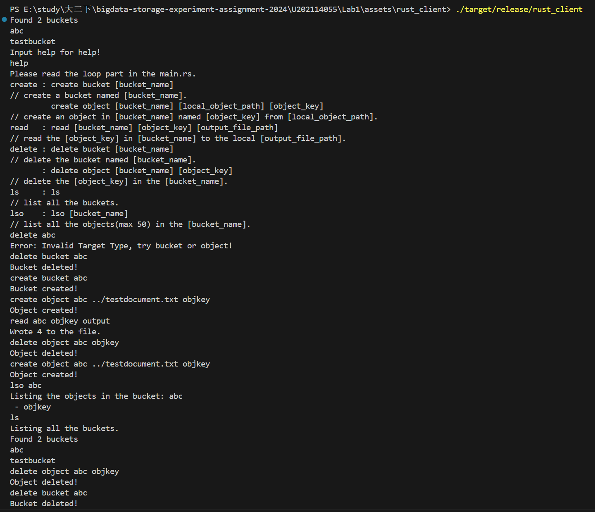

# 实验名称 
***Lab 2 实践基本功能***

# 实验环境
- rust 版本：rustc 1.77.0 
- rust 依赖：
```
anyhow = { version = "1" }
tokio = { version = "1", features = ["macros", "rt-multi-thread"] }
aws-config = { version = "1", features = ["behavior-version-latest"] }
aws-sdk-s3 = { version = "1", features = ["behavior-version-latest"] }
rusoto_core = "0.48.0"
rusoto_credential = "0.48.0"
aws-credential-types = { version = "=1.1.5", features = ["hardcoded-credentials"] }
```
# 实验记录

## 参考资料
[aws sdk s3官方示例](https://docs.aws.amazon.com/zh_tw/sdk-for-rust/latest/dg/rust_s3_code_examples.html)

[aws-sdk-rust-examples](https://developer.qiniu.com/kodo/12572/aws-sdk-rust-examples)

[aws sdk s3文档](https://docs.rs/aws-sdk-s3/latest/aws_sdk_s3/)

[aws-sdk-s3详细api网址](https://docs.rs/aws-sdk-s3/latest/aws_sdk_s3/struct.Client.html#method.put_object)

## rust 客户端的实现
在查阅了上述的资料之后，我使用了aws sdk for rust来编写客户端应用程序。
如下所示的函数，创建并返回了一个连接到openstack-swift且支持aws s3接口的客户端。参考我们之前`Lab1`中查阅到的s3api官网的原话（make sure you have setting the tempauth middleware configuration in proxy-server.conf, and the access key will be the concatenation of the account and user strings that should look like test:tester, and the secret access key is the account password. The host should also point to the swift storage hostname.），我们应该将ACCESS_KEY_ID设置为"swift123:swift123"，并且将SECRET_ACCESS_KEY设置为"swift_key".
```rust
const ACCESS_KEY_ID: &str = "swift123:swift123";
const SECRET_ACCESS_KEY: &str = "swift_key";
async fn create_s3_client(show_config:bool) -> Client {
    
    let config = aws_config::from_env()
        .endpoint_url("http://127.0.0.1:12345".to_string())
        .credentials_provider(SharedCredentialsProvider::new(Credentials::from_keys(
            ACCESS_KEY_ID.to_string(),
            SECRET_ACCESS_KEY.to_string(),
            None,
        )))
        .load()
        .await;
    let s3_local_config = aws_sdk_s3::config::Builder::from(&config).build();
    if show_config {
        println!("{:#?}", s3_local_config);
    }
    let client = Client::from_conf(s3_local_config);
    return client;
}
```

然后在main函数调用`create_s3_client`函数建立一个连接之后，就可以在main函数的loop里面读取用户输入的命令，然后对输入的命令进行字符串解析，就可以分别在对应匹配的情况下实现`CRUD`(Create，Read，Update，Delete)命令的实现（具体所有函数的实现见代码）

```rust
 loop {
        let mut input = String::new();
        io::stdin().read_line(&mut input).expect("Failed to read the input!");
        // 去掉两端空格
        let input = input.trim();
        let args: Vec<&str> = input.split_whitespace().collect();
        let command = match args.get(0) {
            Some(cmd) => *cmd,
            None => {
                println!("No command read.");
                continue;
            }
        };
        match command {
            "quit" => {
            }
            "help" => {
            }
            "create" => {
            }
            "read" => { 
            }
            "delete" => {
            }
            "ls" => { // list all buckets
            }
            "lso" => { // list objects
            }
            _ => {
            }
        }
    }
```

在完成客户端代码的编写之后，进入到/assets/rust_client文件夹中运行cargo run，具体的输入`help`可以在终端中查看所有支持的命令，输入`create bucket`并且在之后跟上自定义的桶的名字可以创建一个存储桶。输入`create object`再加上存储桶的名字，读入文件的本地路径以及创建的对象的key就可以在指定的桶中创建一个对象（同理该命令也可以用来更新对象）。`read`命令跟上存储桶的名字和对象的键值以及输出的地址就可以读取服务器中存储对象的内容并且保存到本地指定的地址当中去。`delete bucket`跟上存储桶的名字可以删除指定空的存储桶，而`delete object`再加上存储桶的名字和对象的键值可以直接删除一个对象。最后`ls`命令可以查看服务器中所有的存储桶列表，`lso`再加上存储桶的名字就可以查看指定存储桶中所有对象的名字。
并且在终端中输入help可以查看如下所示的所有支持的命令。
```
help
Please read the loop part in the main.rs.
create : create bucket [bucket_name] 
// create a bucket named [bucket_name].
create : create object [bucket_name] [local_object_path] [object_key] 
 // create or update an object in [bucket_name] named [object_key] from [local_object_path].
read   : read [bucket_name] [object_key] [output_file_path] 
// read the [object_key] in [bucket_name] to the local [output_file_path].
delete : delete bucket [bucket_name] 
// delete the bucket named [bucket_name].
delete : delete object [bucket_name] [object_key] 
// delete the [object_key] in the [bucket_name].
ls     : ls 
// list all the buckets.
lso    : lso [bucket_name] 
// list all the objects(max 50) in the [bucket_name].
```

如下图所示，我们可以按照help中的提示执行如下的命令，对客户端和服务端支持的功能进行测试：


# 实验小结
在本节实验当中，我使用了rust 以及 aws sdk for rust 变成实现了一个客户端，并且成功连接上了在`Lab1`中实现的服务端，最后编程实现了访问持久存储的4项基本操作（CRUD），并通过运行客户端对所有操作进行了验证。
此外本节实验也有效的锻炼到了我在面对陌生的api时，查阅官方文档和相关资料的信息检索能力和自学能力。