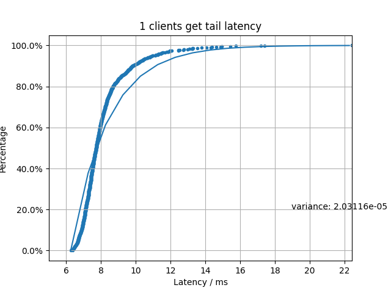
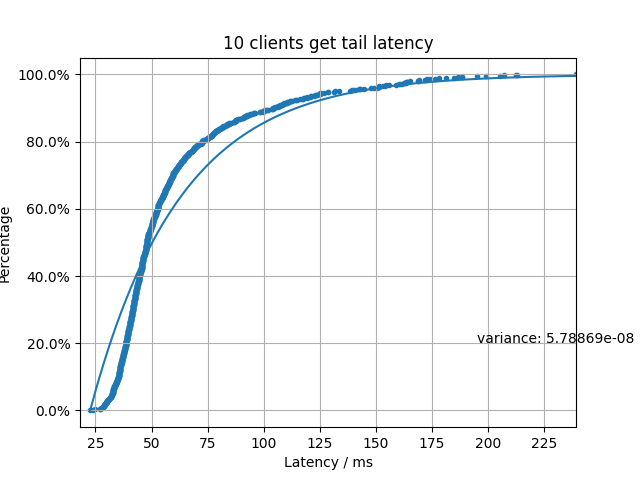
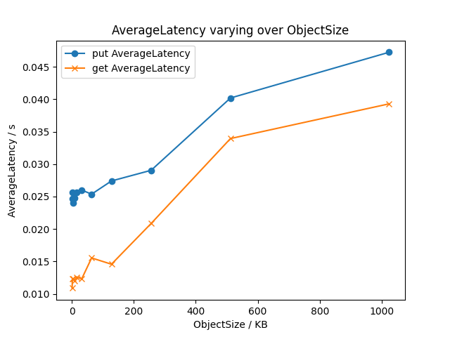
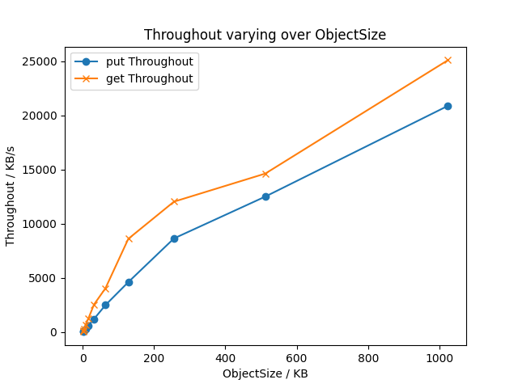
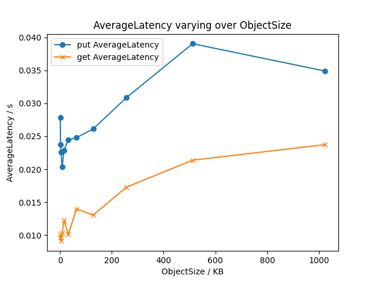
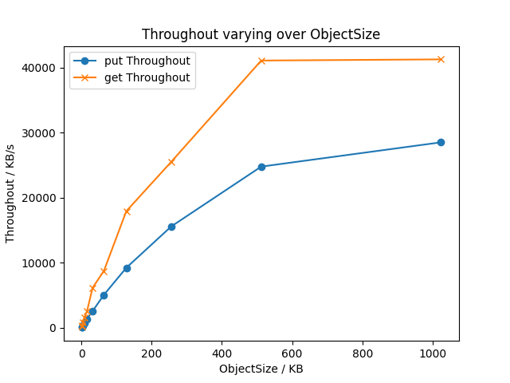

# 实验名称
观测分析性能
# 实验环境
| 属性| 值|
|:--------:|:-------:|
|设备名称   |LAPTOP-U93DQ6K3|
|处理器	    |AMD Ryzen 5 4600H with Radeon Graphics 3.00 GHz|
|机带 RAM	|16.0 GB (15.4 GB 可用)|
|系统类型	|64 位操作系统, 基于 x64 的处理器
|Windows规格|Windows 11 家庭中文版|
|Linux版本| Ubuntu 22.04.2 LTS(WSL 2) |
# 实验记录
测试脚本基于python-swiftclient的API接口来实现对服务器的读写请求，并基于python的matplotlib模块进行画图，部分代码参考自优秀学长/学姐，并在此基础上修复了一些不严谨的测试逻辑，如测量时间段不合理等，我同时将代码中的一些属性进行了参数化，使得测试代码的可重用性更强，并在尾延迟中加入了一些特有的测试模块。
## 实验3-1 探究并发数对于性能的影响
### 吞吐量
如下图所示，get/put对比可发现，get的吞吐量明显更高；而对比不同的并发数可发现：
1. 提高并发数确实可以提高吞吐量，因为当服务器端还没有形成请求排队时，并发量越高（在脚本中，并发量其实就意味着在任一时刻里，有多少的请求处于已发送且未收到回复的状态），则可以更大程度地使服务器处于忙碌状态，从而获得更高的吞吐量。
2. 当并发数提高到一定程度后便不再上升，这是因为此时服务器已经处于饱和排队阶段，再继续提高并发数，只会使得排队队列变长，甚至由于队列过长还会导致吞吐量下降。
3. 本图没有显现的，但实际存在的一个问题：当并发数逐步从10到20到30到40的不断测试的过程中，最终会出现操作失败的情况。但是，如果仅测试40甚至50，就不会出现这样的问题，也就是说，测试之间不具有独立性，这可能是由于使用的是镜像，前面测试时socker等资源的释放并不会立即导致实际socker资源的释放，从而导致后面的socker资源不够用。

### 平均时延
对比不同的并发数，可以发现：
1. 平均时延会随着并发数的上升而不断提高，这也是可以解释的，因为并发数高会导致排队，从而产生高时延。

### 尾延迟
根据排队论，尾延迟有如下的公式。在探究并发度对于尾延迟的影响时，发现学长的脚本中的固定a完全无法拟合对应的实际数据，便由此引出了一部分关于该公式中的a的实际含义以及实际数据关于该模型的拟合程度的探究。

$$
F(t)=1-e^{-a*t}
$$

如下图所示，依次给出并发数为1和10时的尾延迟（由于二者横坐标数值存在较大差异，便放在两张图里）。散点表示实际的数据点，曲线为依据排队论模型进行非线性最小二乘法拟合出的曲线，variance表示误差。可以发现：

1. 误差值都极小，证明排队论模型确实能较好地拟合实际数据；
2. 不同的并发量对应的a实际上差距相差极大，此处1并发数的a为0.47，10并发数的a为0.02，而通过询问老师以及对网上相关资料的查阅，a实际上表征着服务速率，当服务速率越高时，相应的尾延迟就会越小。当并发数不断提高，就容易导致排队甚至部分请求的高延迟，服务速率下降，从而导致非常高的尾延迟。
3. 当并发数为1时，实际上可以将a简化平均延迟的倒数，通过计算平均延迟的倒数为0.31，可以发现确实也与实际的a较为吻合

## 实验3-2 探究对象大小对于性能的影响
在实际探究的过程中，发现在以不同的并发数为固定参数的情况，会得到许多不一样的结论，说明二者可能对于性能有协同的影响，故下文将以并发数为1和为2时的情况，进行一些简单的分析：
### 并发数为1时
1. 平均延迟：可以看到，当并发数为1时，随着对象大小的增大，平均时延有着明显的上升趋势，对象大小变大则处理时间变长，这是很符合直观的。

2. 吞吐量：可以看到，当并发数为1时，呈现基本正比例的相关关系，这也说明了一个一个数据发送时，整个模型是非常理想且稳定的，故也呈现出非常有规律性的数据。

### 并发数为2时
1. 平均时延：可以看到，中间的一段还是正常的上升趋势，但在size极小时，会有一个极高的延迟，可能是因为频繁连接然后断连会导致服务器性能下降，而当size到达1024KB时，会出现时延的迅速下降，此时实际上只有一个请求，请求数少于并发数。经过查看512KB的两个请求和1024KB的一个请求的实际延迟时间，发现1024K的请求比512KB的第一个请求都高不了多少，而512KB的第二个请求的延迟则显著地高于1024KB请求，这可能和服务端实际的IO读写策略有关，也可能是时间的瓶颈在于建立连接等其他过程，而不在于数据真正的put过程，由于时间有限，便没有做下一步验证。（经过了多次测试，都是类似曲线，并不是偶然情况）

2. 吞吐量：整体仍是上升的趋势，但由于并发数的提高，斜率明显增大，且很快到达了服务器的处理能力上限，再增加size，也几乎无法提高吞吐量。

### 并发数更高时
当并发数更高时，到了请求数小于并发数的阶段，数据会出现剧烈的波动，这也说明了其中还有着大量的其他因素在产生影响。
# 实验小结
1. 在这个实验中，我学习了如何使用python-swiftclient的api、python线程池、matplotlib等模块来进行测试和绘图。我一开始对于python的使用基本一窍不通，便只能参考优秀学长学姐的脚本，先尝试运行起来看看效果，到后来我能够读通代码逻辑，并尝试对代码进行一些简单的修改，再到后来不断地在测试中发现一些出乎我所意料的现象，我能够自己书写一些测试代码，做一些自己的探究，简单验证自己的一些猜想，我想在这个过程中，我收获颇丰。
2. 同时，在测试的过程中，发现的各种“不规律”的情况也让我认识到计算机系统的复杂性，很多因变量是受各种自变量共同影响的，实际系统中的很多事情并没有想象中的那么理想和线性，自己对于计算机存储系统的理解还非常的浅薄，仍需不断地学习，不断地进步。