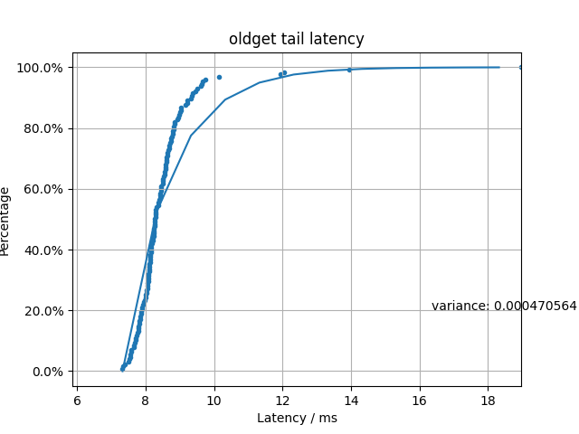

# 实验名称
探究对冲请求对于尾延迟的影响
# 实验环境
| 属性| 值|
|:--------:|:-------:|
|设备名称   |LAPTOP-U93DQ6K3|
|处理器	    |AMD Ryzen 5 4600H with Radeon Graphics 3.00 GHz|
|机带 RAM	|16.0 GB (15.4 GB 可用)|
|系统类型	|64 位操作系统, 基于 x64 的处理器
|Windows规格|Windows 11 家庭中文版|
|Linux版本| Ubuntu 22.04.2 LTS(WSL 2) |
# 实验记录
本实验选取了如下的参数进行测试：
| 属性| 值|
|:--------:|:-------:|
|总传输字节数total_size|4*128 KB|  
|对象大小object_size | 4 KB |
|测试请求总个数num_samples |128|
|并发数num_client | 1|
|超时对冲数hedge_cnt | 1 |
|超时时间hedge_time | 90%尾延迟对应时间|

测试方式说明：首先多次运行普通无对冲版本，统计90%尾延迟的平均延迟时间，并将其作为超时时间hedge_time，然后运行对冲版本，发起一个请求时开始计时，当该请求超过hedge_time仍未得到响应，就发送hedge_cnt个该请求，并对这hedge_cnt+1个请求进行等待，直到某个请求得到响应，才停止计时。相应的核心测试代码如下：
```python
def bench_get(i):
    obj_name = '%s%08d' % (object_name_prefix, i)
    start = time.time()

    with ThreadPoolExecutor(max_workers=5) as executor:
        future=executor.submit(conn.get_object,bucket_name,obj_name)
        wait([future],timeout=hedge_time)
        if not future.done():
            hedge_requests = [executor.submit(conn.get_object,bucket_name,obj_name) for i in range(hedge_cnt)]
            hedge_requests.append(future)
            done, not_done = wait(hedge_requests, return_when=FIRST_COMPLETED)
            for future in not_done:
                future.cancel()
            resp_headers, obj_contents = done.pop().result()
        else:
            resp_headers, obj_contents = future.result()
    with open(obj_name, 'wb') as f:
        f.write(obj_contents)
    end = time.time()
    duration = end - start
    client = current_thread().name
    return (duration, start, end, client)
```
测试结果：如下图所示，在进行了对冲请求之后，最大延迟和99%、95%、90%的延迟时间都比原来要小，而随着比例的变小，对冲请求之后的延迟值反而变小，这实际上是由于对冲发送重复数据导致的，这说明对冲请求实际上有一种"拉平效应"，通过额外的补偿来降低尾延迟。


如下图，依次给出对冲前后的直观的散点图，可以看到，经过对冲之后，尾延迟问题显著地缓解了：




# 实验小结
1. 通过本次实验，我了解了对冲请求的原理，也学习了如何使用对冲请求来缓解尾延迟；
2. 通过本次实验，我对于python中的线程池模块有了更深的理解，学会了如何同时监控线程池里的所有线程，从而使用简单的几行代码便能够将对冲请求的逻辑实现；
3. 通过本次实验，我还学会了如何利用python中matplotlib.pyplot库画直方图和散点图，学会了如何优雅地呈现自己获取到的数据，从而直观地呈现数据对应的结论。