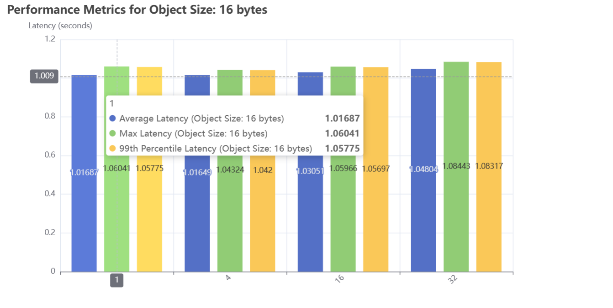
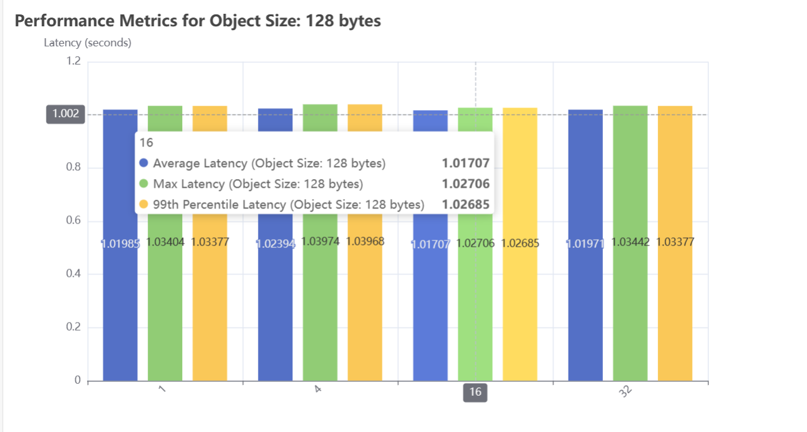
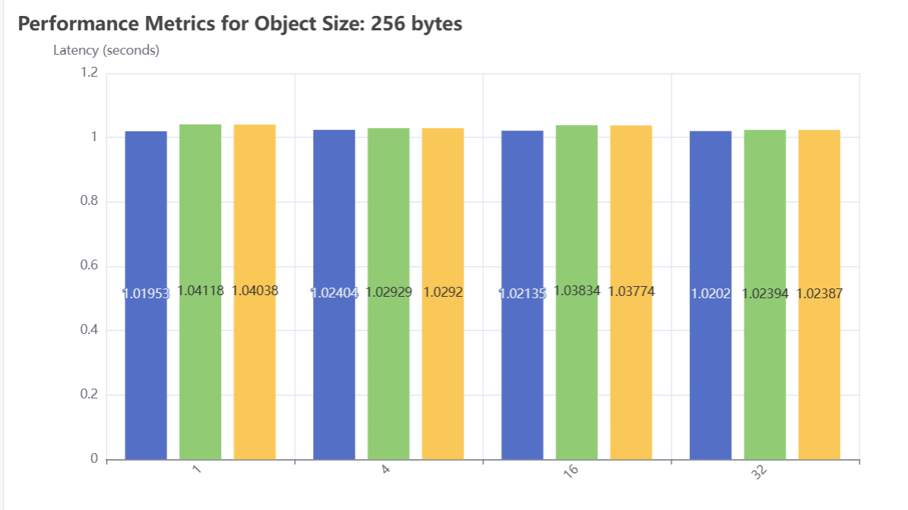
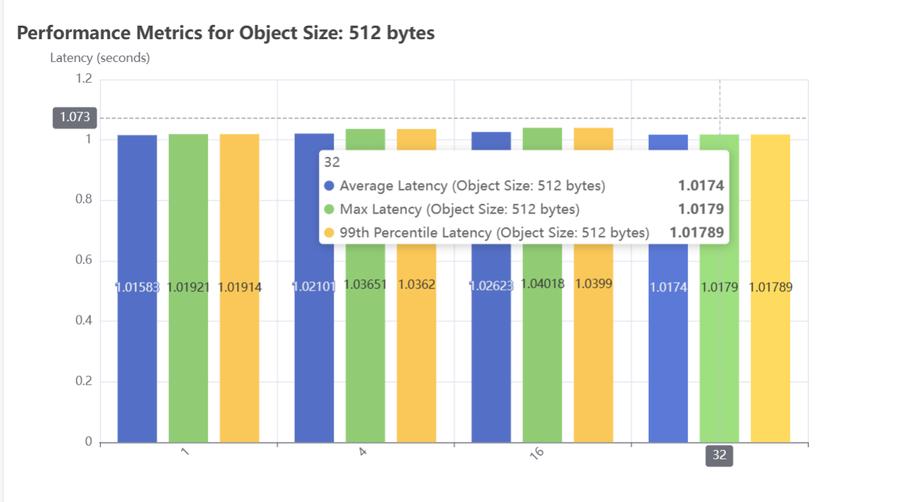
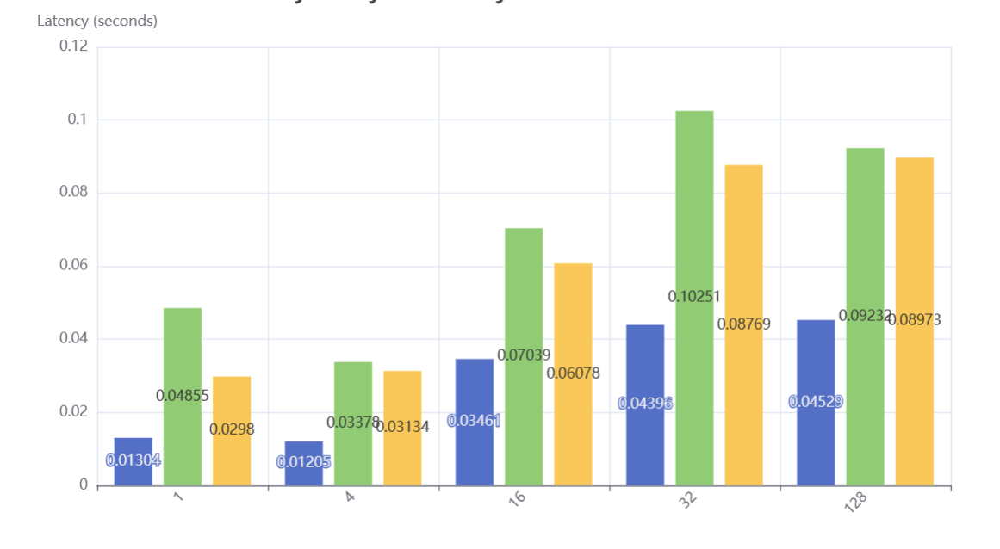
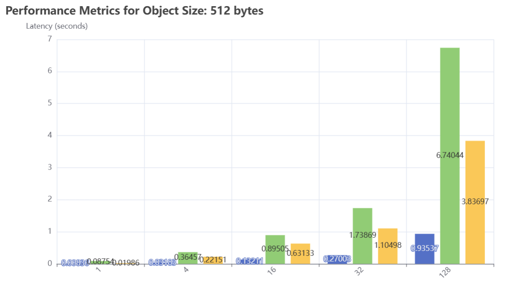

# 实验名称

# 实验环境

| 操作系统 | Windows 11 专业版                                          |
| ---------- | ------------------------------------------------------------ |
| 处理器   | AMD Ryzen 5 4600U with Radeon Graphics            2.10 GHz |
| 内存     | 16G                                                        |
| 服务器端 | mock_s3 && MinIO Server                                    |
| 系统类型 | 64 位操作系统, 基于 x64 的处理器                           |
| 客户端   | Boto3                                                      |

# 实验记录

## 实验lab3

### mock_s3 Server

#### Put

##### Object_size与吞吐速率、传输时间的关系

表1-1 mock_s3 Put:Object_size影响吞吐率

| Object_size | total_transferred | numClients | duration | numErrors | throughput            |
| ------------- | ------------------- | ------------ | ---------- | ----------- | ----------------------- |
| 16          | 1024 bytes        | 1          | 65.246 s | 0         | 15.694 bytes/second  |
| 64          | 1024 bytes        | 1          | 16.271 s | 0         | 62.934 bytes/second   |
| 128         | 1024 bytes        | 1          | 8.152 s  | 0         | 125.61 bytes/second   |
| 256         | 1024 bytes       | 1          | 4.053 s  | 0         | 252.565 bytes/second  |
| 512         | 1024 bytes       | 1          | 2.021 s  | 0         | 506.741 bytes/second |

图1-1  mock_s3 Put:Object_size影响吞吐率

* 从16到128的并发数范围内，增加并发数可以减少总持续时间，并提高吞吐率，这表明`mock-s3`服务端能够有效地处理增加的并发请求。
* 然而，当并发数从128增加到256时，尽管数据中没有明确提供吞吐率，但持续时间的增加可能表明系统开始遇到瓶颈或超负荷。
* 当并发数达到512时，尽管总持续时间最短，但吞吐率显著提高，表明系统在这个并发数下运行得非常高效。

##### 不同Object_size与Num Of Clients对不同延迟的影响

`object_size=[16,64,128,256,512],num_clients=[1,4,16,32]`测试不同object_size和num_clients对mock_s3服务端的`平均延迟、最大延迟、99尾延迟`的影响，具体可视化图如下：

图1-2  mock_s3 Put:Object_size:16 不同并发数影响延迟分布

图1-3  mock_s3 Put:Object_size:64 不同并发数影响延迟分布

图1-4  mock_s3 Put:Object_size:128 不同并发数影响延迟分布

图1-5  mock_s3 Put:Object_size:256 不同并发数影响延迟分布

图1-6  mock_s3 Put:Object_size:512 不同并发数影响延迟分布

为了能够快速展现数据，我将总传输量设置为1024bytes。而由于总传输量太小，导致不同的num_clients和object_size对延迟的影响效果较小。

1. **平均延迟 (Average Latency)** ：

   * 随着对象大小的增加，平均延迟也略有增加，但变化不大，这表明`mock-s3`服务端处理不同大小对象的效率相对稳定。
2. **最大延迟 (Max Latency)** ：

   * 数据显示，最大延迟随着对象大小的增加而略有增加。
3. **延迟百分位数 (Percentiles)** ：

   * 即随着对象大小的增加，高百分位的延迟也有所增加。

而在使用Minio Server的时候，我将总传输量设置为1024*1024bytes,同时设置更多的object_size和num_clients，从而获得了更加直观的感受：

- 同一object_size，并发量(num_clients)越大，各项延迟指标越来越大。
- 同一并发量(num_clients),object_size越大，延迟指标先变大后变小，所以对一个存储系统，为保证服务质量，应该选择一个较大的对象尺寸进行传输。
- 综上所述，当一个系统的请求并发数变大的时候，系统的延迟也会变大，同时由终端输出的数据可以看出，此时系统的吞吐率也在下降。

#### get

##### 不同并发数对延迟分布的影响

表1-2 mock_s3 Get:Num_clients影响延迟分布

| numClients | total_transferred | duration | throughput             | errors |
| ------------ | ------------------- | ---------- | ------------------------ | -------- |
| 1          | 74752 bytes       | 1.848 s  | 40446.124 bytes/second | 0      |
| 4          | 74752 bytes       | 1.604 s  | 46604.244 bytes/second | 0      |
| 8          | 74752 bytes       | 2.858 s  | 26153.695 bytes/second | 0      |
| 16         | 74752 bytes       | 4.99 s   | 14980.594 bytes/second | 0      |
| 32         | 74752 bytes       | 9.383 s  | 7967.048 bytes/second  | 0      |
| 64         | 74752 bytes       | 7.464 s  | 10014.96 bytes/second  | 0      |
| 128        | 74752 bytes       | 7.965 s  | 9385.322 bytes/second  | 0      |
| 256        | 74752 bytes       | 6.436 s  | 11615.374 bytes/second | 0      |
| 512        | 74752 bytes       | 7.194 s  | 10390.247 bytes/second | 0      |
| 1024       | 74752 bytes       | 7.041 s  | 10617.251 bytes/second | 0      |

图1-7  mock_s3  Get:不同并发数影响吞吐率

1. **并发数与吞吐率的关系** ：

   * 在较低的并发数（例如1, 4, 8）时，随着并发数的增加，吞吐率也随之增加。
   * 但是，当并发数超过8之后，增加并发数并没有继续提高吞吐率，反而出现了下降的趋势。这可能是因为`mock-s3`服务端或网络资源达到了瓶颈，无法有效处理更多的并发请求。

##### 不同object_size与num_clients对延迟分布的影响

图1-8  mock_s3  Get:不同并发数影响延迟分布

1. **平均延迟 (average_latency)** ：
   * 当并发数从1增加到4时，平均延迟从0.01304秒减少到0.012048秒，表明增加并发数可以减少单个请求的平均延迟。
   * 但是，当并发数继续增加，从4增加到16时，平均延迟增加到0.03461秒，这表明随着并发数的增加，系统开始感受到压力，延迟开始增加。
   * 并发数从16增加到32，再到128，平均延迟持续增加，分别为0.04396秒、0.04528秒和0.04529秒，这进一步证实了系统在高并发下的性能下降。
2. **最大延迟 (max_latency)** ：
   * 最大延迟的趋势与平均延迟类似，随着并发数的增加，最大延迟也增加。这表明在高并发下，最慢的请求所经历的延迟也在增加。
3. **吞吐率 (throughput)** ：
   * 吞吐率在并发数为1和4时最高，分别为39257.73和42495.68字节/秒。
   * 当并发数增加到16时，吞吐率显著下降到14793.73字节/秒，表明系统开始成为瓶颈。
   * 并发数继续增加，吞吐率进一步下降，表明更多的并发请求并没有带来更多的吞吐量，反而降低了单个请求的处理速度。
4. **延迟百分位数 (percentiles)** ：
   * 延迟百分位数提供了对延迟分布的更深入了解。随着并发数的增加，较高百分位的延迟值也在增加，这意味着不仅平均延迟增加，而且较慢请求的延迟也显著增加。

**结论** ：

* 在低并发数下，增加并发可以提高吞吐率并减少平均延迟。
* 但是，当并发数超过某个点（在这个案例中大约是4）后，继续增加并发会导致系统资源争用，从而增加延迟，并降低吞吐率。
* 并发数的增加导致了延迟分布的右移，即延迟更高的请求变得更为常见。

### Minio Server

##### puts_吞吐量，传输时间：

表2-1 minio Put:Object_size影响吞吐率

| Object_size | total_transferred | numClients | duration | numErrors | throughput             |
| ------------- | ------------------- | ------------ | ---------- | ----------- | ------------------------ |
| 512         | 1048576 bytes     | 1          | 17.248 s | 0         | 60793.273bytes/second  |
| 1024        | 1048576 bytes     | 1          | 8.472 s  | 0         | 123774.113bytes/second |
| 2048        | 1048576 bytes     | 1          | 4.243 s  | 0         | 247127.053bytes/second |
| 4096        | 1048576 bytes     | 1          | 2.07 s   | 0         | 506522.299bytes/second |
| 8192        | 1048576 bytes     | 1          | 1.05s    | 0         | 999100.526bytes/second |

图2-1  minio Put:Object_size影响吞吐率

##### puts——延迟:

图2-2  minio Put:Object_size:512 不同并发数影响延迟分布

图2-3  minio Put:Object_size:1024 不同并发数影响延迟分布

图2-4  minio Put:Object_size:2048 不同并发数影响延迟分布

图2-5  minio Put:Object_size:4096 不同并发数影响延迟分布

图2-6  minio Put:Object_size:8192 不同并发数影响延迟分布

##### gets——吞吐量，传输时间：

表2-2 minio Het:Num_clients影响吞吐率

| numClients | total_transferred | duration | throughput               | errors |
| ------------ | ------------------- | ---------- | -------------------------- | -------- |
| 1          | 1196032 bytes     | 0.677 s  | 1767279.491 bytes/second | 0      |
| 4          | 1196032 bytes     | 1.915 s  | 624689.453 bytes/second  | 0      |
| 8          | 1196032 bytes     | 3.595 s  | 332734.977 bytes/second  | 0      |
| 16         | 1196032 bytes     | 5.538 s  | 215958.779 bytes/second  | 0      |
| 32         | 1196032 bytes     | 5.771 s  | 207263.482 bytes/second  | 0      |
| 64         | 1196032 bytes     | 5.194 s  | 230254.36 bytes/second   | 0      |
| 128        | 1196032 bytes     | 5.087 s  | 235113.876 bytes/second  | 0      |
| 256        | 1196032 bytes     | 5.745 s  | 208180.769 bytes/second  | 0      |
| 512        | 1196032 bytes     | 5.665 s  | 211123.831 bytes/second  | 0      |
| 1024       | 1196032 bytes     | 4.608 s  | 259570.931 bytes/second  | 0      |

图2-7  minio  Get:不同并发数影响吞吐率

##### gets——延迟:

图2-8  minio  Get:不同并发数影响延迟分布

# 实验小结

在该实验中，我首先使用Minio Server进行了不同方面的测试，得到一系列数据。在实验文档中保存了这部分数据截图。然后将服务端换成了mock_s3，进行同样的测试，而为了能够更快获得数据，选择将总传输量降低。通过对不同数据的分析得到不同的结论。
