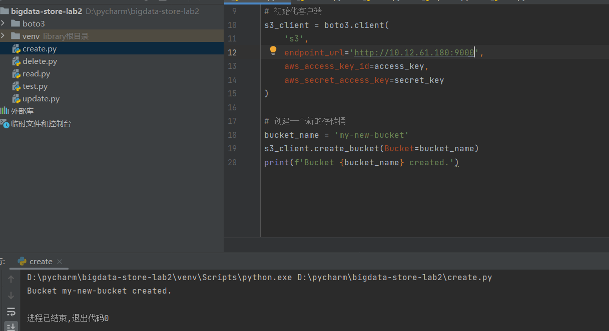
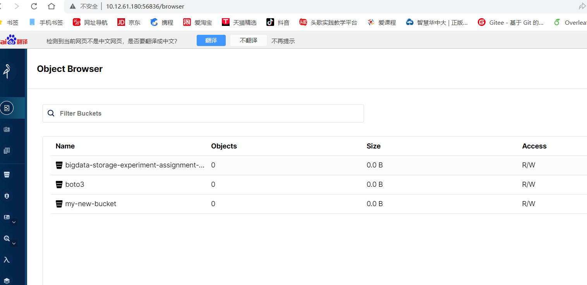
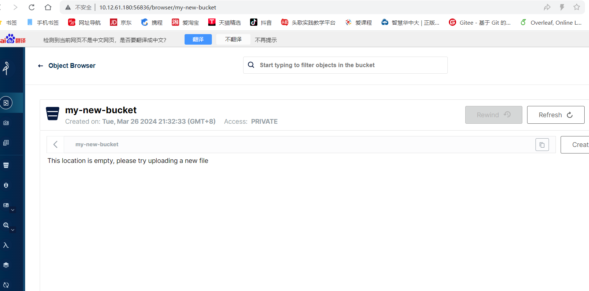
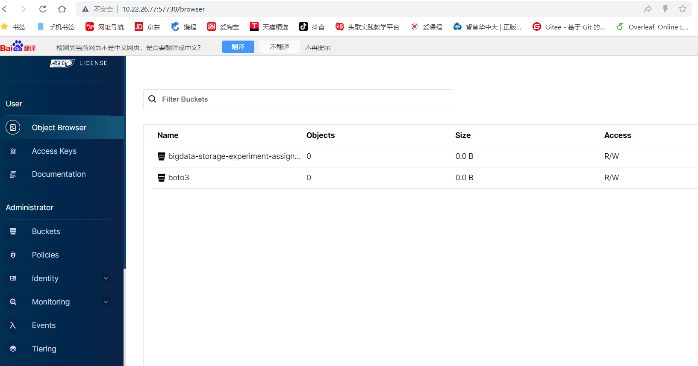

# 实验名称
实践基本功能
# 实验环境
操作系统	Windows 11 专业版
设备名称	    LAPTOP-Q8LHEHM1
处理器	        AMD Ryzen 7 5800H with Radeon Graphics            3.20 GHz
机带 RAM	  16.0 GB (15.9 GB 可用)
服务器端	  MinIO Server
系统类型	  64 位操作系统, 基于 x64 的处理器

# 实验记录
1.根据实验文档提供的Boto3源代码安装
git clone https://github.com/boto/boto3.git
cd boto3
python -m pip install -r requirements.txt
python -m pip install -e .

2.建立Boto3客户端和Minio Server的连接
①首先启动Minio Server
②创建Minio Server的Access Keys,

③修改test.py中的access_key,secret_key为自己创建好的密钥，同时修改endpoint_url为Minio Server正在运行的API地址，然后就可以运行，从而测试客户端和服务端是否能够正确建立连接，如果能够正常建立连接，程序会打印出所有的存储桶。

3.Minio Server初始状态

4.使用Create.py程序创建了一个新的存储桶my-new-bucket

5.my-new-bucket存储桶在更新前是一个空桶。

6.Update.py程序向my-new-bucket桶上传了一个文件fortest.txt，其中object_key可以自行设置，但要保证不重复原则。

7.Read.py——读取：获取存储桶中的对象列表

8.Delete.py ——初始的时候，我又上传了一个新的文件 API地址.txt，然后删除，这个时候再删除桶的时候发现报错——即如果桶不为空，则无法删除
于是更改删除代码——删除桶的所有文件，成功删除桶

# 实验小结
成功建立了客户端和服务端之间的联系，实现了客户端通过不同的API对服务端的四种基本操作——Create，read，update，delete。同时发现，当存储桶不为空的时候，无法直接删除。