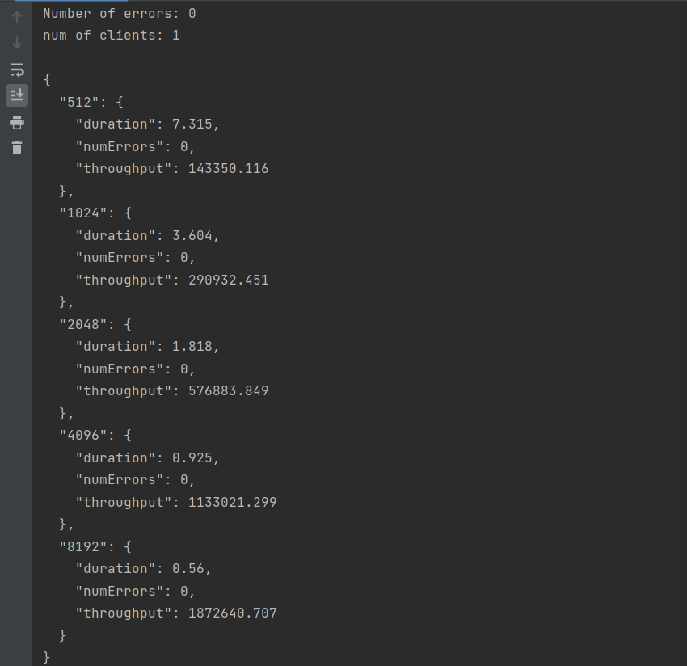
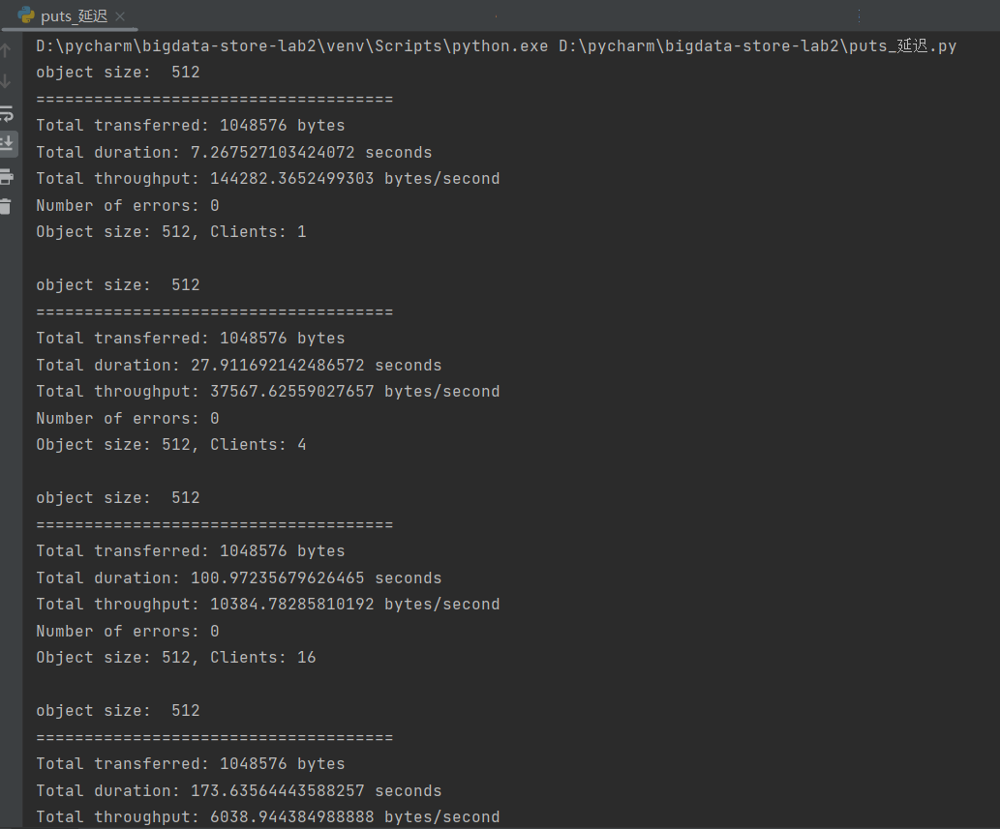
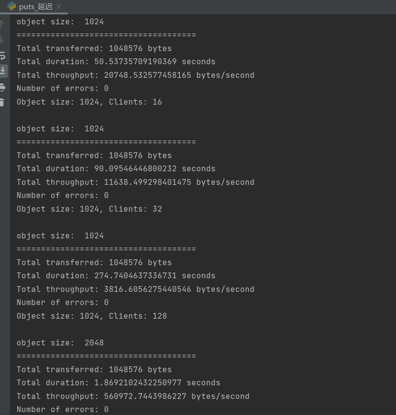
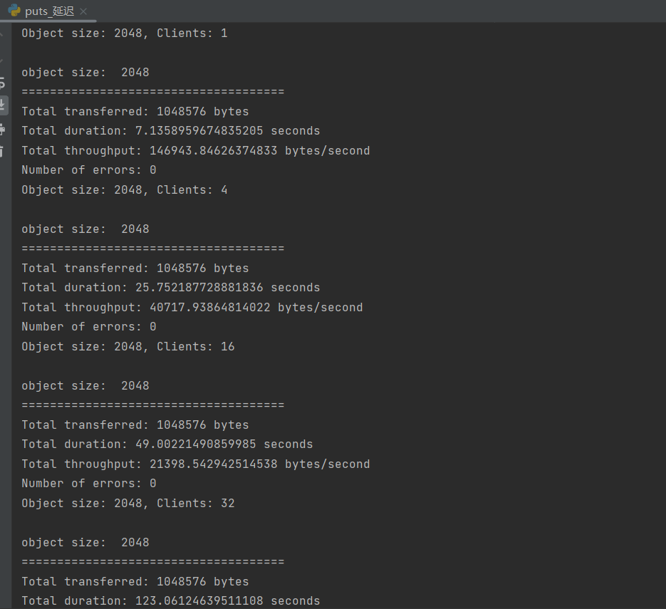
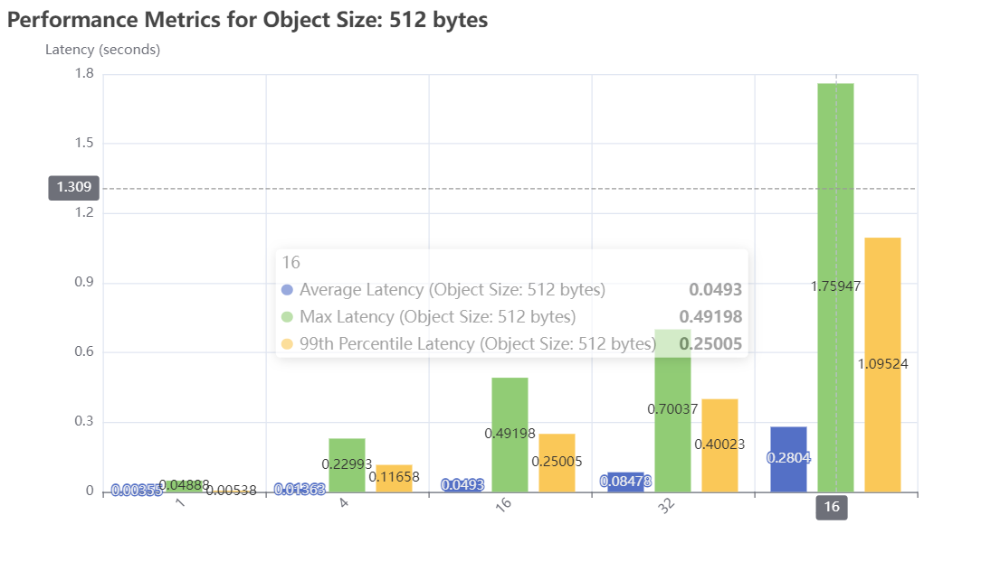
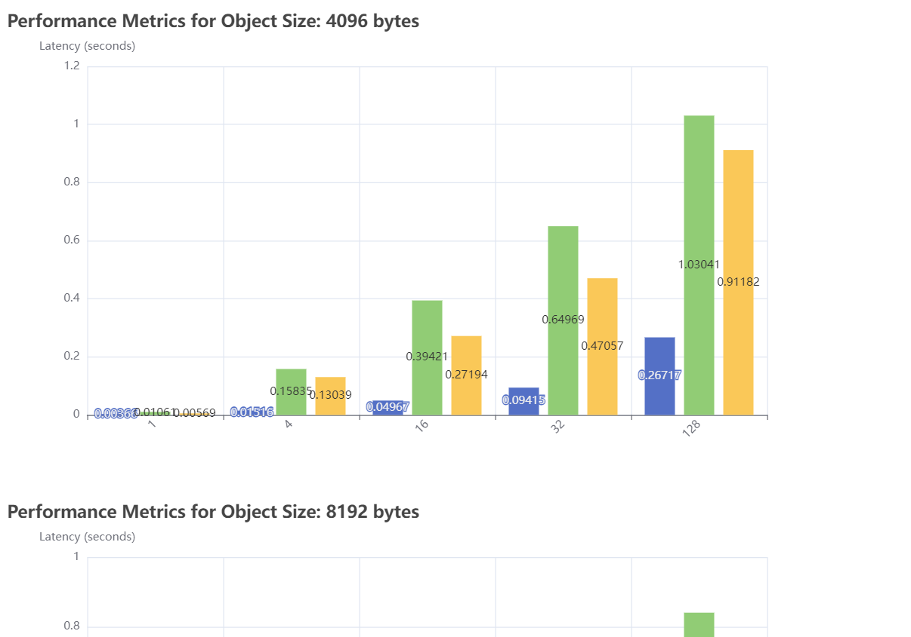
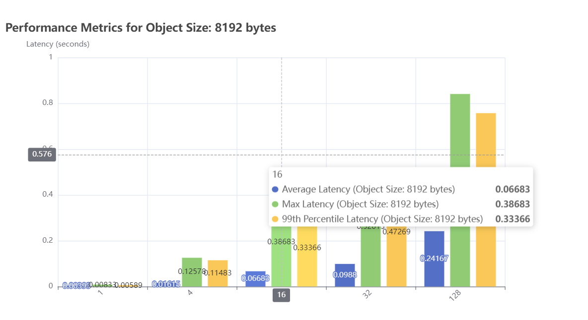
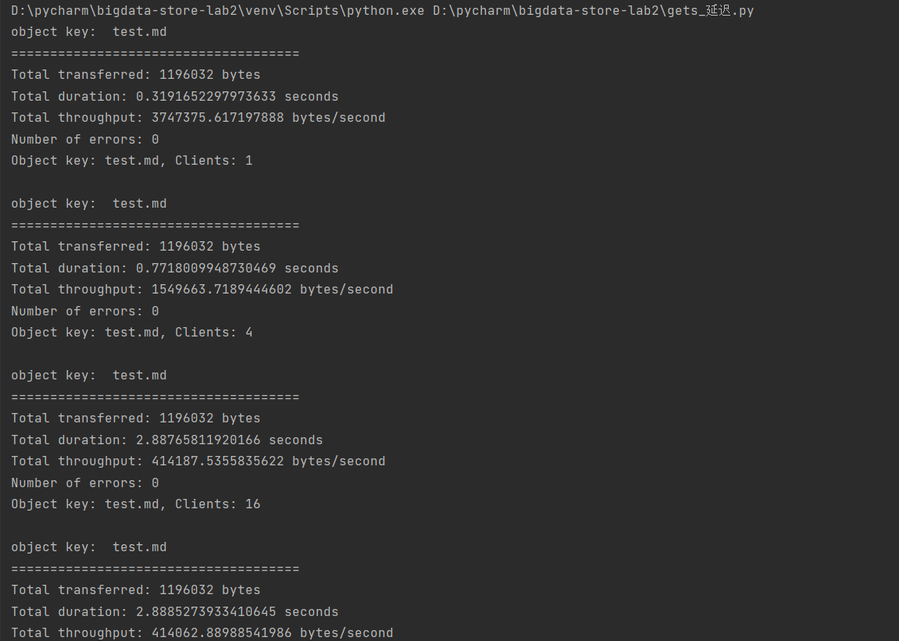
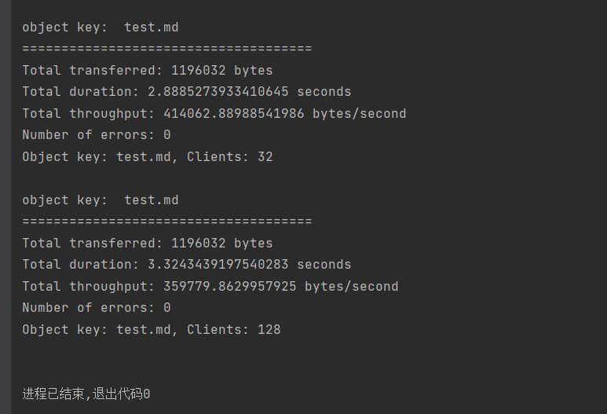
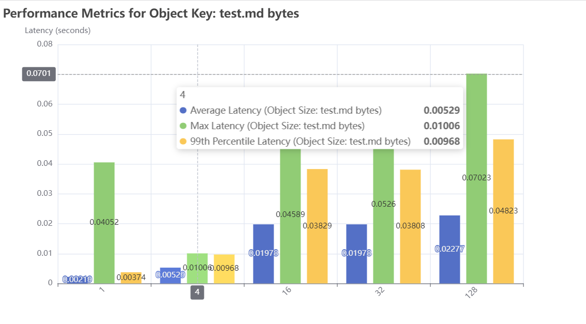

# 实验名称
观测分析性能
# 实验环境
操作系统	Windows 11 专业版
设备名称	    LAPTOP-Q8LHEHM1
处理器	        AMD Ryzen 7 5800H with Radeon Graphics            3.20 GHz
机带 RAM	  16.0 GB (15.9 GB 可用)
服务器端	  MinIO Server
系统类型	  64 位操作系统, 基于 x64 的处理器

# 实验记录
1.new_puts.py
观测不同的对象尺寸对文件上传的吞吐量和传输时间的影响

(put_object函数用于将指定大小的对象上传到S3服务,并返回上传的时间、对象大小和是否发生错误。  benchmark函数用于并发上传多个对象,并计算总的上传时间、吞吐量和错误数量。)

图1.1

图1.2

图1.3

2.puts_延迟.py
观测不同的对象尺寸和并发数对文件上传的延迟分布的影响

3.gets.py
观测不同的并发数对文件获取的吞吐量和传输时间的影响

4.gets_延迟.py
观测不同的对象尺寸和并发数对文件获取的延迟分布的影响

# 实验小结