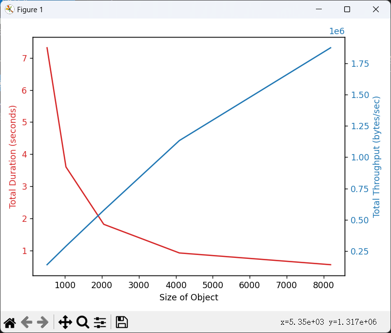
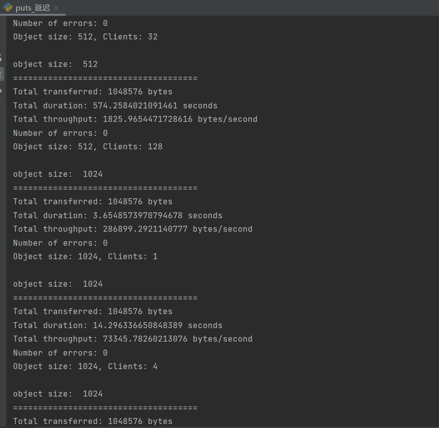
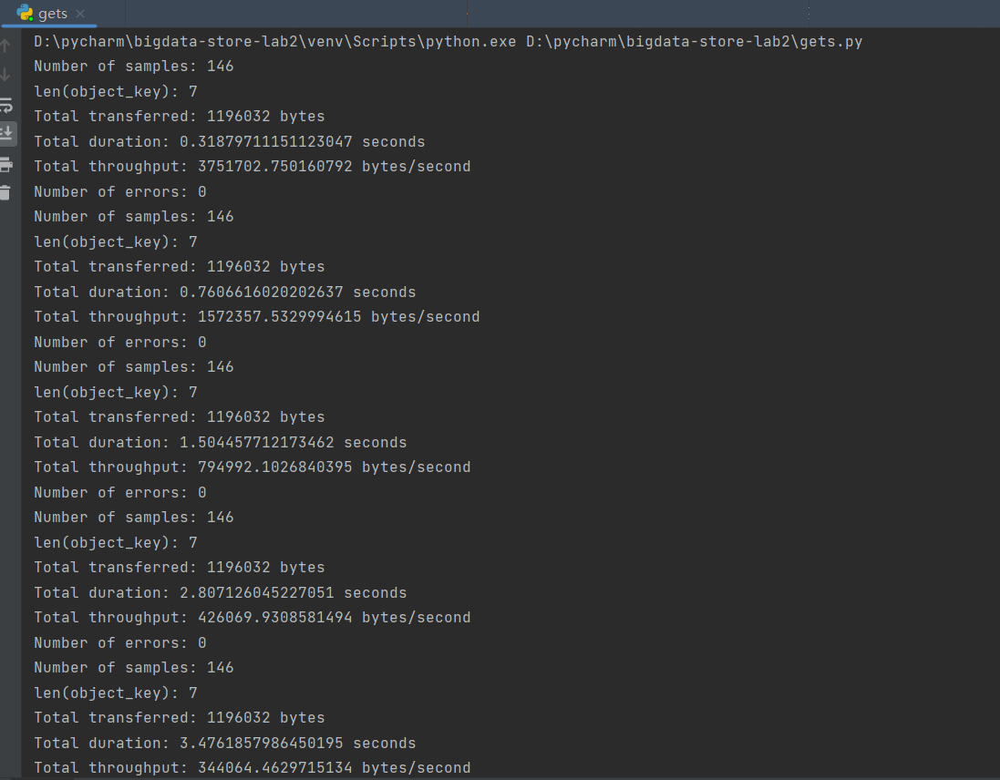
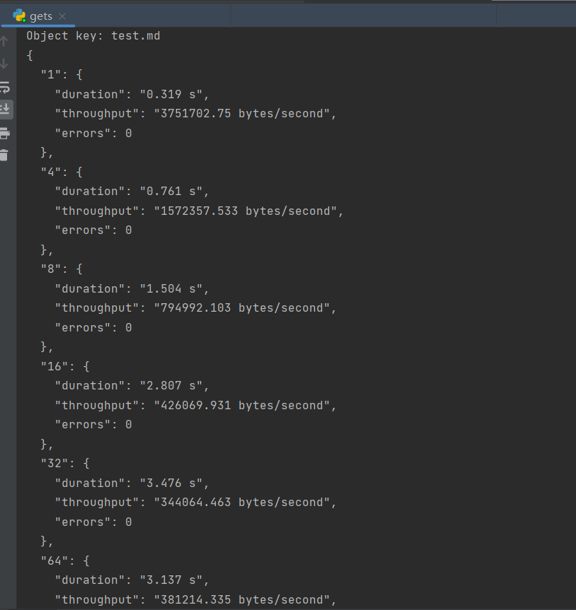
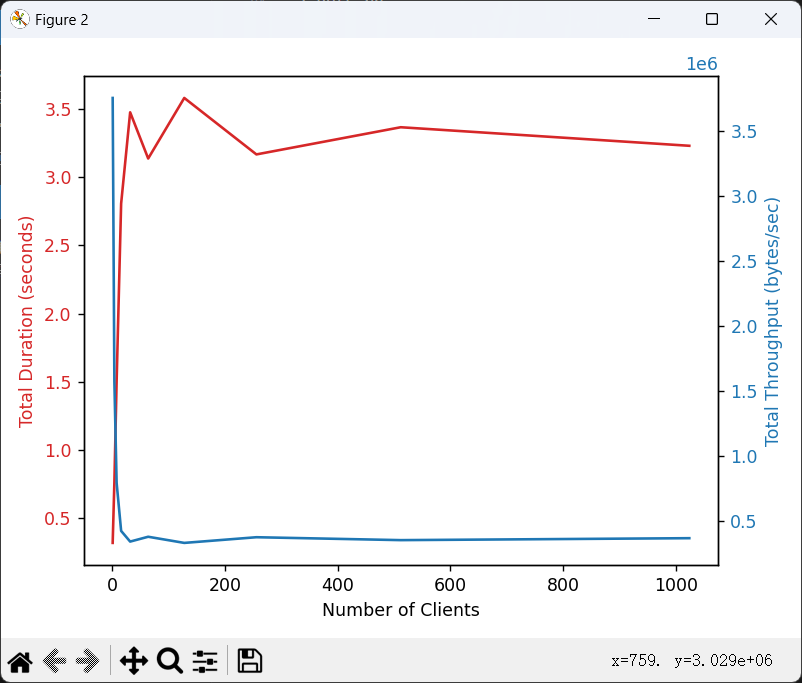

# 实验名称
观测分析性能
# 实验环境
|操作系统	|Windows 11 专业版|
| ------- | ------- |
|设备名称|LAPTOP-Q8LHEHM1|
|处理器	 |     AMD Ryzen 7 5800H with Radeon Graphics         3.20 GHz|
|机带 RAM	|  16.0 GB (15.9 GB 可用)|
|服务器端	|  MinIO Server|
|系统类型	|  64 位操作系统, 基于 x64 的处理器|
|客户端	| Boto3|

# 实验记录
**1.new_puts.py**
观测不同的对象尺寸对文件上传的吞吐量和传输时间的影响

(put_object函数用于将指定大小的对象上传到S3服务,并返回上传的时间、对象大小和是否发生错误。  benchmark函数用于并发上传多个对象,并计算总的上传时间、吞吐量和错误数量。)

图1.1

图1.2

图1.3

经过观察分析可知：
从512到8192的并发数范围内，增加并发数可以减少总持续时间，并提高吞吐率，这表明MinIO Server服务端能够有效地处理增加的并发请求。
当并发数达到8192时，尽管总持续时间最短，但吞吐率显著提高，表明系统在这个并发数下运行得非常高效。

**2.puts_延迟.py**
观测不同的对象尺寸和并发数对文件上传的延迟分布的影响

经过观察分析可知：
同一object_size，并发量(num_clients)越大，各项延迟指标越来越大。
同一并发量(num_clients),object_size越大，延迟指标先变大后变小，所以对一个存储系统，为保证服务质量，应该选择一个较大的对象尺寸进行传输。
综上所述，当一个系统的请求并发数变大的时候，系统的延迟也会变大，同时由终端输出的数据可以看出，此时系统的吞吐率也在下降。

**3.gets.py**
观测不同的并发数对文件获取的吞吐量和传输时间的影响

经过观察分析可知：
增加并发数并没有提高吞吐率，反而出现了下降的趋势。这可能是因为MinIO Server服务端或网络资源达到了瓶颈，无法有效处理更多的并发请求。

**4.gets_延迟.py**
观测不同的对象尺寸和并发数对文件获取的延迟分布的影响

经过观察分析可知：
**1.平均延迟 (average_latency) ：**
随着并发数的增加，平均延迟也增加。这表明在高并发下，系统的性能在下降。

**2.最大延迟 (max_latency) ：**
当并发数从1增加到4时，最大延迟从0.04052秒减少到0.01006秒，表明增加并发数可以减少单个请求的最大延迟。
但是，当并发数继续增加，从4增加到16时，最大延迟增加到0.04589秒，这表明随着并发数的增加，系统开始感受到压力，延迟开始增加。
并发数从16增加到32，再到128，最大延迟持续增加，分别为0.0526秒、0.07023秒，这进一步证实了系统在高并发下的性能下降。

**3.吞吐率 (throughput) ：**
吞吐率在并发数为1时最高，是3747375.6字节/秒。
当并发数增加到16时，吞吐率显著下降到414187.5字节/秒，表明系统开始成为瓶颈。
并发数继续增加，吞吐率进一步下降，表明更多的并发请求并没有带来更多的吞吐量，反而降低了单个请求的处理速度。

**4.延迟百分位数 (percentiles) ：**
延迟百分位数提供了对延迟分布的更深入了解。随着并发数的增加，较高百分位的延迟值也在增加，这意味着不仅平均延迟增加，而且较慢请求的延迟也显著增加。
# 实验小结
在该实验中，使用了Minio Server进行了不同方面的测试，得到一系列数据，并进行相关的分析。同时，使用了python的matplotlib和pyecharts库进行数据的可视化，生成了相关的图表和html文件。