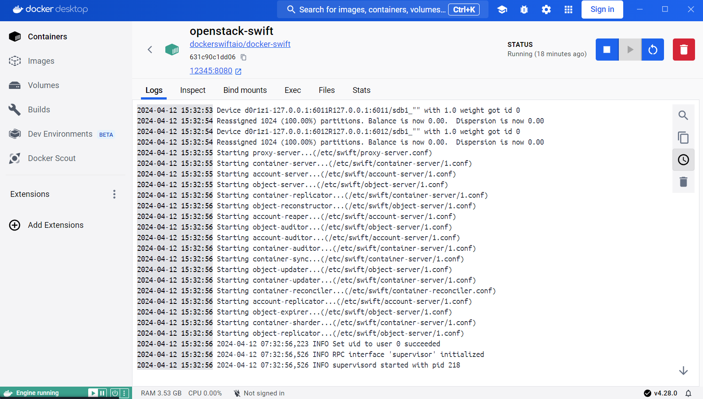

# 搭建对象存储

# 实验环境
## 设备规格
设备名称:PC-20220816MCRP
处理器:AMD Ryzen 7 5800H with Radeon Graphics            3.20 GHz
机带RAM：16.0 GB (13.9 GB 可用)
设备ID：FDEC451E-C684-46EA-BA0E-86B1C0A7A29E
产品ID：00425-00000-00002-AA954
系统类型：64 位操作系统, 基于 x64 的处理器
笔和触控：没有可用于此显示器的笔或触控输入

## 环境规格
版本 Windows 10 家庭中文版
版本号 21H2
安装日期 2022/‎8/‎16
操作系统内部版本 19044.4291
体验 Windows Windows Feature Experience Pack 1000.19056.1000.0
# 实验记录
使用指令`docker pull dockerswiftaio/docker-swift`下载镜像文件[dockerswiftaio](https://hub.docker.com/r/dockerswiftaio/docker-swift)

查看下载的镜像文件

通过查看`\ect\swift\proxy-serxer.conf`发现`bind_port`为`8080`,即使用端口为8080.
使用指令''将该镜像打开并且设置端口8080为12345

启动docker文件

# 实验小结
学会使用docker的基本指令，下载对应镜像文件，并且在实验调整过程中对openstack swift系统有了基础的了解，搭建了swift服务器端。