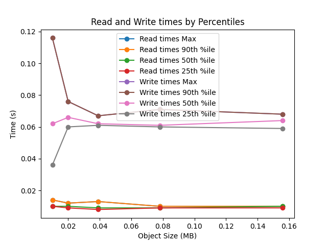

# 搭建对象存储

# 实验环境
## 设备规格
设备名称:PC-20220816MCRP
处理器:AMD Ryzen 7 5800H with Radeon Graphics            3.20 GHz
机带RAM：16.0 GB (13.9 GB 可用)
设备ID：FDEC451E-C684-46EA-BA0E-86B1C0A7A29E
产品ID：00425-00000-00002-AA954
系统类型：64 位操作系统, 基于 x64 的处理器
笔和触控：没有可用于此显示器的笔或触控输入

## 环境规格
版本 Windows 10 家庭中文版
版本号 21H2
安装日期 2022/‎8/‎16
操作系统内部版本 19044.4291
体验 Windows Windows Feature Experience Pack 1000.19056.1000.0
# 实验记录
下载go环境:


下载S3bench


验证下载


使用Lab2的python程序创造test-bucket数据桶\
使用命令`s3bench -accessKey=test:tester -accessSecret=testing -bucket=testbucket -endpoint=http://localhost:12345 -numClients=2 -numSamples=10 -objectNamePrefix=loadgen -objectSize=1024 -region=us-east-1`删除桶：

输出如下：
```sh
endpoint(s):      [http://localhost:12345]
bucket:           test-bucket
objectNamePrefix: loadgen
objectSize:       0.0010 MB
numClients:       2
numSamples:       10
verbose:       %!d(bool=false)


Generating in-memory sample data... Done (0s)

Running Write test...

Running Read test...

Test parameters
endpoint(s):      [http://localhost:12345]
bucket:           test-bucket
objectNamePrefix: loadgen
objectSize:       0.0010 MB
numClients:       2
numSamples:       10
verbose:       %!d(bool=false)


Results Summary for Write Operation(s)
Total Transferred: 0.010 MB
Total Throughput:  0.03 MB/s
Total Duration:    0.298 s
Number of Errors:  0
------------------------------------
Write times Max:       0.063 s
Write times 99th %ile: 0.063 s
Write times 90th %ile: 0.063 s
Write times 75th %ile: 0.062 s
Write times 50th %ile: 0.060 s
Write times 25th %ile: 0.057 s
Write times Min:       0.051 s


Results Summary for Read Operation(s)
Total Transferred: 0.010 MB
Total Throughput:  0.29 MB/s
Total Duration:    0.033 s
Number of Errors:  0
------------------------------------
Read times Max:       0.008 s
Read times 99th %ile: 0.008 s
Read times 90th %ile: 0.008 s
Read times 75th %ile: 0.007 s
Read times 50th %ile: 0.007 s
Read times 25th %ile: 0.006 s
Read times Min:       0.006 s

Cleaning up 10 objects...
Deleting a batch of 10 objects in range {0, 9}... Succeeded
Successfully deleted 10/10 objects in 153.3073ms
```

完成测试后通过修改命令行对应参数进行实验：
```sh
D:\go1.21.9.windows-amd64\GO项目\library\bin> s3bench -accessKey=test:tester -accessSecret=testing -bucket=test-bucket -endpoint=http://localhost:12345 -numClients=2 -numSamples=10 -objectNamePrefix=loadgen -objectSize=1024 -region=us-east-1 >test_objectsize_1024.txt

D:\go1.21.9.windows-amd64\GO项目\library\bin> s3bench -accessKey=test:tester -accessSecret=testing -bucket=test-bucket -endpoint=http://localhost:12345 -numClients=2 -numSamples=10 -objectNamePrefix=loadgen -objectSize=2048 -region=us-east-1 >test_objectsize_2048.txt

D:\go1.21.9.windows-amd64\GO项目\library\bin> s3bench -accessKey=test:tester -accessSecret=testing -bucket=test-bucket -endpoint=http://localhost:12345 -numClients=2 -numSamples=10 -objectNamePrefix=loadgen -objectSize=4096 -region=us-east-1 >test_objectsize_4096.txt

D:\go1.21.9.windows-amd64\GO项目\library\bin> s3bench -accessKey=test:tester -accessSecret=testing -bucket=test-bucket -endpoint=http://localhost:12345 -numClients=2 -numSamples=10 -objectNamePrefix=loadgen -objectSize=8192 -region=us-east-1 >test_objectsize_8192.txt

D:\go1.21.9.windows-amd64\GO项目\library\bin> s3bench -accessKey=test:tester -accessSecret=testing -bucket=test-bucket -endpoint=http://localhost:12345 -numClients=2 -numSamples=10 -objectNamePrefix=loadgen -objectSize=16384 -region=us-east-1 >test_objectsize_16384.txt
```

指令在`D:\go1.21.9.windows-amd64\GO项目\library\bin>`文件夹中生成多个测试文件[test_objectsize_1024.txt](test_result/test_objectsize_1024.txt),[test_objectsize_2048.txt](test_result/test_objectsize_2048.txt),[test_objectsize_4096.txt](test_result/test_objectsize_4096.txt),[test_objectsize_8192.txt](test_result/test_objectsize_8192.txt),[>test_objectsize_16384.txt](test_result/test_objectsize_16384.txt)

使用python程序[plot](plot/plot.py)绘制各项数据关于oversize的图像:




分析图像可知，当objectsize增大时，对应的Transferred，throughput对应的吞吐量也成比例变化，而duration，各个百分百的读写时间几乎不变说明该系统稳定。

分析：当宽带，存储基础设施等并不限制传输时：总数据传输量是系统在特定时间段内传输的数据总量。它是通过测试期间传输的对象数量乘以每个对象的大小计算得出的，由于每个对象的大小变大，包的总数量不变，所以其成线性增长

吞吐量是指系统在单位时间内传输的数据量。当对象大小增加时，每个请求传输的数据量增加。即使请求数量保持不变，系统在处理这些请求时需要传输的数据量变大，从而导致单位时间内传输的数据量线性增加。

# 实验小结
在本次实验中使用了S3bench进行了服务器性能的测试，然后整理数据绘图进行分析。